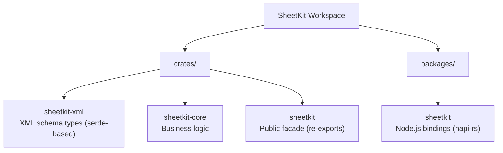
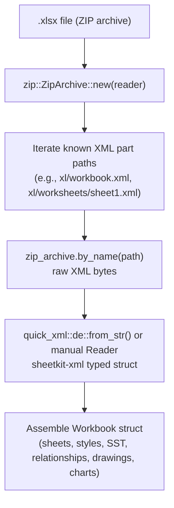
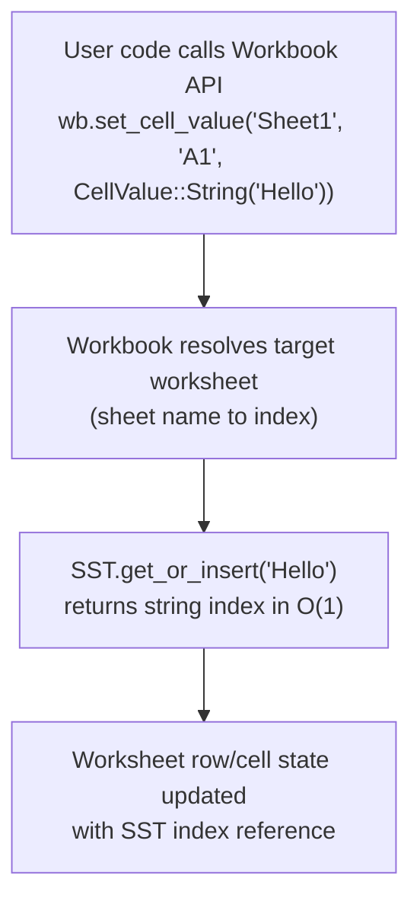
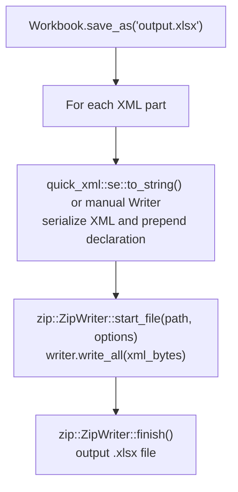
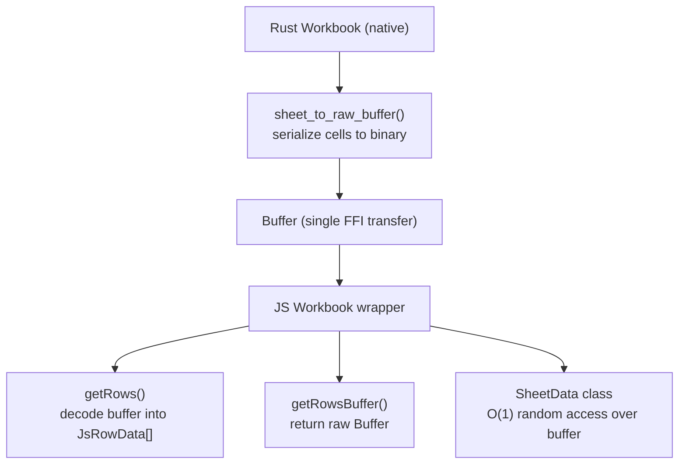

# SheetKit Architecture

## 1. Overview

SheetKit is a high-performance SpreadsheetML library for Rust and TypeScript, designed for reading and writing Excel (.xlsx) files. The .xlsx format is OOXML (Office Open XML), which is a ZIP archive containing XML parts. SheetKit reads the ZIP, deserializes each XML part into typed Rust structs, exposes a high-level API for manipulation, and serializes everything back into a valid .xlsx file on save.

## 2. Crate Structure

### sheetkit-xml

Low-level XML data structures mapping to OOXML schemas. Each file corresponds to a major OOXML part:

| File | OOXML Part |
|---|---|
| `worksheet.rs` | Worksheet (sheet data, merge cells, conditional formatting, validations) |
| `shared_strings.rs` | SharedStrings (SST) |
| `styles.rs` | Stylesheet (fonts, fills, borders, number formats, XF records, DXF records) |
| `workbook.rs` | Workbook (sheets, defined names, calc properties, pivot caches) |
| `content_types.rs` | `[Content_Types].xml` |
| `relationships.rs` | `.rels` relationship files |
| `chart.rs` | Chart definitions (DrawingML charts) |
| `drawing.rs` | DrawingML (anchors, shapes, image references) |
| `comments.rs` | Comment data and authors |
| `doc_props.rs` | Core, App, and Custom document properties |
| `pivot_table.rs` | Pivot table definitions |
| `pivot_cache.rs` | Pivot cache definitions and records |
| `namespaces.rs` | OOXML namespace constants |

All types use `serde::Deserialize` and `serde::Serialize` derive macros with `quick-xml` attributes for XML element/attribute mapping.

### sheetkit-core

All business logic lives here. The central type is `Workbook` in `workbook.rs`, which owns the deserialized XML state and provides the public API.

**Core modules:**

| Module | Responsibility |
|---|---|
| `workbook.rs` | Opens ZIP, deserializes XML parts, manages mutable state, serializes and saves |
| `cell.rs` | `CellValue` enum (String, Number, Bool, Empty, Date, Formula, Error), date serial number conversion via chrono |
| `sst.rs` | Shared Strings Table runtime with HashMap for O(1) string deduplication |
| `sheet.rs` | Sheet management: create, delete, rename, copy, set active, freeze/split panes, sheet properties, sheet protection |
| `row.rs` | Row operations: insert, delete, duplicate, set height, visibility, outline level, row style, iterators |
| `col.rs` | Column operations: set width, visibility, insert, delete, outline level, column style |
| `style.rs` | Style system: font, fill, border, alignment, number format, cell protection. StyleBuilder API with automatic XF deduplication |
| `conditional.rs` | Conditional formatting: 17 rule types (cell value, color scale, data bar, top/bottom, above/below average, duplicates, blanks, errors, text matching, etc.) using DXF records |
| `chart.rs` | Chart creation for 43 chart types (bar, line, pie, area, scatter, radar, stock, surface, doughnut, combo, 3D variants). Manages DrawingML anchors and relationships |
| `image.rs` | Image embedding (11 formats: PNG, JPEG, GIF, BMP, ICO, TIFF, SVG, EMF, EMZ, WMF, WMZ) with two-cell anchors in DrawingML |
| `validation.rs` | Data validation rules (dropdown, whole number, decimal, text length, date, time, custom formula) |
| `comment.rs` | Cell comments using VML drawing format |
| `table.rs` | Table and auto-filter support |
| `hyperlink.rs` | Hyperlinks: external and email use worksheet .rels, internal (sheet-to-sheet) use location attribute only |
| `merge.rs` | Merge and unmerge cell ranges |
| `doc_props.rs` | Core (dc:, dcterms:, cp:), App, and Custom document properties. DC namespace requires manual quick-xml Writer/Reader |
| `protection.rs` | Workbook-level protection with legacy password hash |
| `page_layout.rs` | Page margins, page setup, print options, header/footer |
| `defined_names.rs` | Named ranges (workbook-scoped and sheet-scoped) |
| `pivot.rs` | Pivot tables: cache definition, cache records, table definition, workbook pivot cache collection |
| `stream.rs` | StreamWriter: forward-only XML writer for generating large files without holding the full sheet in memory. Supports SST merging, freeze panes, row options, column style/visibility/outline |
| `error.rs` | Error types using thiserror |

**Formula subsystem** (`formula/`):

| File | Responsibility |
|---|---|
| `parser.rs` | nom-based formula parser producing an AST. Handles operator precedence, cell references, range references, function calls, string/number/boolean literals |
| `ast.rs` | AST node types (BinaryOp, UnaryOp, FunctionCall, CellRef, RangeRef, Literal, etc.) |
| `eval.rs` | Formula evaluator. Uses `CellDataProvider` trait for workbook data access and `CellSnapshot` (HashMap) to avoid borrow checker issues. `calculate_all()` builds a dependency graph and uses Kahn's algorithm for topological sort |
| `functions/mod.rs` | Function dispatch table mapping function names to implementations |
| `functions/math.rs` | Math functions (SUM, AVERAGE, ABS, ROUND, etc.) |
| `functions/statistical.rs` | Statistical functions (COUNT, COUNTA, MAX, MIN, STDEV, etc.) |
| `functions/text.rs` | Text functions (CONCATENATE, LEFT, RIGHT, MID, LEN, TRIM, etc.) |
| `functions/logical.rs` | Logical functions (IF, AND, OR, NOT, IFERROR, etc.) |
| `functions/information.rs` | Information functions (ISBLANK, ISERROR, ISNUMBER, TYPE, etc.) |
| `functions/date_time.rs` | Date/time functions (DATE, TODAY, NOW, YEAR, MONTH, DAY, etc.) |
| `functions/lookup.rs` | Lookup functions (VLOOKUP, HLOOKUP, INDEX, MATCH, etc.) |

**Utilities** (`utils/`):

| File | Responsibility |
|---|---|
| `cell_ref.rs` | Cell reference parsing: "A1" to (row, col), column letter conversion, range parsing |
| `constants.rs` | Shared constants |

### sheetkit (facade)

Thin re-export crate. Its `lib.rs` contains `pub use sheetkit_core::*;` so that end users depend on `sheetkit` and get the full public API.

### sheetkit-node (packages/sheetkit)

Node.js bindings via napi-rs (v3, no compat-mode).

- `src/lib.rs` -- Single file containing all bindings. The `#[napi]` `Workbook` class wraps `sheetkit_core::workbook::Workbook` in an `inner` field. Methods delegate to `inner` and convert between Rust types and napi-compatible types.
- `#[napi(object)]` structs define JS-friendly data transfer types (e.g., `JsStyle`, `JsChartConfig`, `JsPivotTableOption`).
- `Either` enums from napi v3 handle polymorphic values (e.g., cell values that can be string, number, or boolean).
- `binding.js` / `binding.d.ts` -- Generated by `napi build --esm`. Low-level native addon exports.
- `index.ts` -- TypeScript source providing the public `Workbook` wrapper class that delegates to the native binding. Also re-exports all types.
- `buffer-codec.ts` -- Binary buffer decoder for efficient row data transfer from Rust to JS.
- `sheet-data.ts` -- `SheetData` class for lazy, zero-copy access to sheet cell data from a binary buffer.
- Generated `.js` and `.d.ts` files are gitignored; tsdown handles both transpilation and declaration generation.

## 3. Key Design Decisions

### XML Processing

Most XML parts are handled by `serde` derive macros with `quick-xml`. However, some OOXML parts use namespace prefixes that serde cannot handle correctly:

- **DC namespace** (`dc:`, `dcterms:`, `cp:` in core properties) -- serialized and deserialized using manual quick-xml Writer/Reader.
- **vt: namespace** (variant types in custom properties) -- also handled manually.

The XML declaration `<?xml version="1.0" encoding="UTF-8" standalone="yes"?>` is prepended manually to each serialized XML part before writing to the ZIP.

### ZIP Archive Handling

The `zip` crate handles reading and writing .xlsx archives. All ZIP entries use `SimpleFileOptions::default().compression_method(CompressionMethod::Deflated)`. On `open()`, every XML part is read into memory and deserialized. On `save()`, every part is re-serialized and written to a new ZIP archive atomically.

### SharedStrings (SST)

The shared strings table is optional in .xlsx files. If `sharedStrings.xml` is not present in the archive, `Sst::default()` is used. At runtime, the SST maintains a `HashMap<String, usize>` for O(1) deduplication: when a string cell value is set, the SST returns an existing index if the string is already present, or inserts it and returns the new index.

### Style Deduplication

When `add_style()` is called, the style components (font, fill, border, alignment, number format, protection) are each checked against existing records. If all components match an existing XF (cell format) record, that record's index is returned without creating a duplicate. This keeps the styles.xml compact.

### CellValue and Date Detection

`CellValue` is an enum with variants: `String`, `Number`, `Bool`, `Empty`, `Date`, `Formula`, `Error`.

On read, numeric cells are checked against the applied number format. If the format ID falls within known date format ranges (built-in IDs 14-22, 27-36, 45-47) or the custom format string contains date/time patterns, the cell is returned as `CellValue::Date(serial_number)` instead of `CellValue::Number`. The chrono crate handles conversion between Excel serial numbers and `NaiveDate`/`NaiveDateTime`.

### Formula System

The formula system has two independent parts:

1. **Parser**: Uses the `nom` crate to parse formula strings into an AST. The parser handles Excel formula syntax including operator precedence, nested function calls, absolute/relative cell references, range references, and all literal types.

2. **Evaluator**: Walks the AST and computes results. The `CellDataProvider` trait abstracts workbook data access so the evaluator does not directly borrow the workbook. Before evaluation, cell values are snapshotted into a `CellSnapshot` (`HashMap<(String, u32, u32), CellValue>`) to avoid mutable/immutable borrow conflicts when one cell's formula references another cell.

   `calculate_all()` evaluates every formula cell in the workbook in dependency order. It builds a directed graph of cell dependencies, performs a topological sort using Kahn's algorithm, and evaluates cells from leaves to roots. Circular references are detected and reported as errors.

### Conditional Formatting

Conditional formatting rules reference DXF (Differential Formatting) records in styles.xml rather than full XF records. DXF records contain only the formatting properties that differ from the cell's base style. SheetKit supports 17 rule types including cell value comparisons, color scales, data bars, top/bottom N, above/below average, duplicates, unique values, blanks, errors, text matching, and formula-based rules.

### Pivot Tables

A pivot table in OOXML consists of 4 interconnected parts:

1. **pivotTable definition** (`pivotTable{n}.xml`) -- field layout, row/column/data/page fields
2. **pivotCacheDefinition** (`pivotCacheDefinition{n}.xml`) -- source range, field definitions
3. **pivotCacheRecords** (`pivotCacheRecords{n}.xml`) -- cached source data
4. **Workbook pivot caches** -- collection in workbook.xml linking cache IDs to definitions

Each pivot table gets its own dedicated cache. The cache definition specifies the source data range, and the cache records store a snapshot of that data.

### StreamWriter

The StreamWriter provides a forward-only API for generating large .xlsx files. Instead of building the full worksheet XML in memory, it writes XML elements directly to the output as rows are added. Constraints:

- Rows must be written in ascending order (no random access).
- The sheet XML is finalized when `flush()` is called.
- SST entries from the stream are merged into the workbook SST on flush.
- Supports freeze panes, row options (height, visibility, outline), and column-level style/visibility/outline.

### napi Bindings Design

The Node.js bindings follow the `inner` field pattern: the napi `Workbook` class contains a `sheetkit_core::workbook::Workbook` as its `inner` field. Each napi method unwraps arguments from JS types, calls the corresponding method on `inner`, and converts the result back to a JS-compatible type.

napi v3 `Either` types are used for polymorphic values instead of `JsUnknown`, providing type safety on both the Rust and TypeScript sides.

## 4. Data Flow

### Reading an .xlsx file

### Manipulating data

### Writing an .xlsx file

## 5. Testing Strategy

- **Unit tests**: Co-located with their modules using `#[cfg(test)]` inline test blocks. Each module tests its own functionality in isolation.
- **Node.js tests**: Located at `packages/sheetkit/__test__/index.spec.ts`. Uses vitest to test the napi bindings end-to-end.
- **Test coverage**: The project maintains over 1,300 Rust tests and 200 Node.js tests across all modules.
- **Test output files**: Any `.xlsx` files generated during tests are gitignored to keep the repository clean.

## 6. Buffer-Based FFI Transfer

### Problem

When reading a 50,000-row by 20-column sheet through the Node.js bindings, the original `getRows()` implementation created over 1,000,000 individual `JsRowCell` napi objects. Each object creation crosses the Rust/JS FFI boundary and allocates V8 heap memory. Combined with the Rust-side workbook data that remains in memory, this led to approximately 400MB of memory usage for a scenario that only requires about 50MB of actual cell data.

The root cause is that napi object creation does not scale: the overhead is proportional to the number of cells, not the size of the data. For a 1M-cell sheet, the napi overhead alone accounts for over 200MB of V8 heap allocations, plus approximately 72MB of Rust-side system allocator overhead from 3M+ individual heap allocations for cell references, type strings, and value strings.

### Solution

SheetKit uses a buffer-based FFI transfer strategy. Instead of creating one JS object per cell, the Rust side serializes the entire sheet's cell data into a single compact binary `Buffer`. This buffer crosses the FFI boundary in one call. On the JavaScript side, a codec layer decodes the buffer into whatever representation the caller needs.

The decision rule is straightforward: if the payload scales with cell count, use buffer transfer. If the payload is fixed-size or small (single cell value, style config, sheet properties), use direct napi calls.

### Binary Buffer Format

All multi-byte values are little-endian. The buffer has four sections.

**Header** (16 bytes):

| Offset | Size | Field | Description |
|--------|------|-------|-------------|
| 0 | 4 | magic | `0x534B5244` ("SKRD") |
| 4 | 2 | version | Protocol version (currently 1) |
| 6 | 4 | row_count | Number of rows in the buffer |
| 10 | 2 | col_count | Number of columns (bounding rectangle width) |
| 12 | 4 | flags | Bit 0: sparse flag. Bits 16-31: min_col offset |

**Row Index** (row_count * 8 bytes):

Each row entry is 8 bytes: a `u32` row number followed by a `u32` byte offset into the cell data section. Empty rows use the sentinel offset `0xFFFFFFFF`.

**String Table**:

| Field | Size | Description |
|-------|------|-------------|
| count | 4 | Number of strings |
| blob_size | 4 | Total size of the UTF-8 blob in bytes |
| offsets | count * 4 | Byte offset of each string within the blob |
| blob | blob_size | Concatenated UTF-8 string data |

Strings are referenced by index from cell payloads. The JavaScript side uses `TextDecoder` to decode UTF-8 slices directly from the buffer without copying.

**Cell Data**:

Each cell is encoded as a 1-byte type tag followed by an 8-byte payload. The type tags are:

| Tag | Type | Payload |
|-----|------|---------|
| 0x00 | Empty | unused (8 zero bytes) |
| 0x01 | Number | f64 IEEE 754 |
| 0x02 | String | u32 string table index + 4 padding bytes |
| 0x03 | Bool | u8 (0 or 1) + 7 padding bytes |
| 0x04 | Date | f64 Excel serial number |
| 0x05 | Error | u32 string table index + 4 padding bytes |
| 0x06 | Formula | u32 string table index (cached display value) + 4 padding bytes |
| 0x07 | RichString | u32 string table index (plain text) + 4 padding bytes |

The fixed 9-byte stride per cell enables O(1) random access in dense mode: the offset of cell at (row, col) is `cell_data_start + row_offset + col * 9`.

### Dense/Sparse Auto-Switch

The buffer encoder automatically selects between dense and sparse layout based on cell density within the bounding rectangle.

**Density threshold**: 30% of cells occupied.

- **Dense layout** (density >= 30%): The cell data section is a flat `row_count * col_count * 9` byte grid. Every position in the bounding rectangle has a 9-byte slot, including empty cells. This enables O(1) direct offset addressing: `offset = row_index_offset + col * 9`.

- **Sparse layout** (density < 30%): Each row stores a `u16` cell count followed by variable-length entries. Each entry is 11 bytes: `u16` column index + `u8` type + 8-byte payload. Only non-empty cells are stored. This avoids wasting space on sheets where data is scattered across a large range with many gaps.

The sparse flag is encoded in bit 0 of the header's flags field. The JavaScript decoder reads this flag and switches decoding strategy accordingly.

### Internal Optimizations

Three optimizations in the Rust XML layer reduce memory allocations during parsing, before buffer serialization even begins.

**CellTypeTag enum**: The XML `t` attribute on `<c>` elements (which indicates cell type: `s` for shared string, `n` for number, `b` for boolean, etc.) was previously stored as `Option<String>`. This allocated a heap `String` for every cell. It is now a 1-byte `CellTypeTag` enum with variants `None`, `SharedString`, `Number`, `Boolean`, `Error`, `Str`, `Date`, and `InlineString`. For 1M cells, this eliminates approximately 24MB of heap allocations.

**CompactCellRef**: The XML `r` attribute on `<c>` elements (the cell reference like "A1", "B2", "AA100") was previously a heap-allocated `String`. It is now a `CompactCellRef` struct containing a `[u8; 10]` inline byte array and a `u8` length field. Since cell references never exceed 10 characters (the maximum is "XFD1048576" at 10 bytes), this fits entirely on the stack or inline within the `Cell` struct, eliminating approximately 28MB of heap allocations per 1M cells.

**Column numbers as u32**: The `get_rows()` internal path previously converted column numbers to column name strings (e.g., 1 to "A", 27 to "AA") inside the Rust layer, allocating a `String` per cell. Column numbers are now returned as `u32` values internally, and name conversion happens only in the JavaScript decoder when needed. This eliminates approximately 5MB of string allocations per 1M cells.
