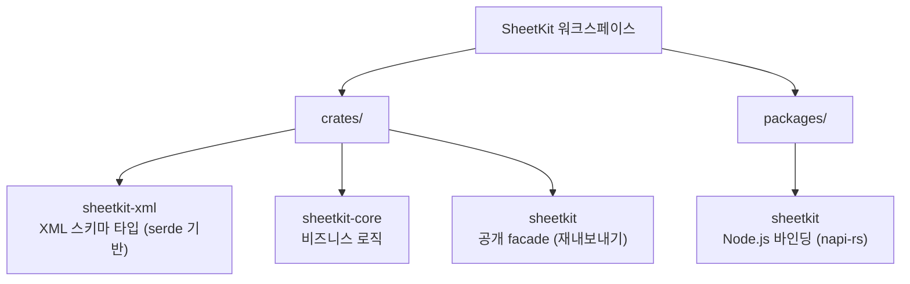
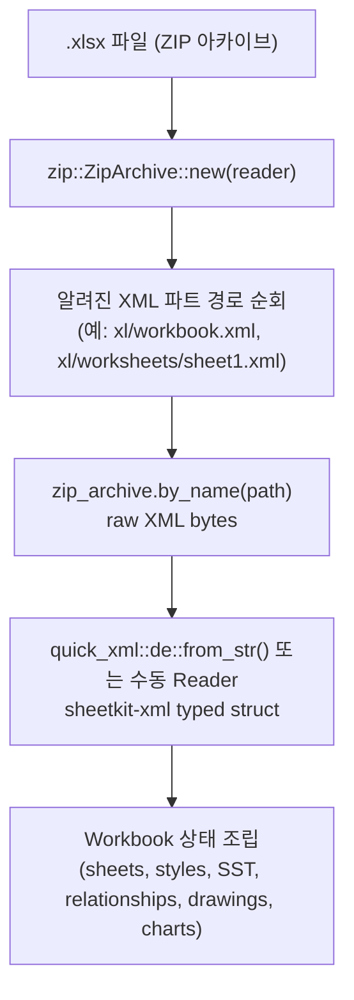
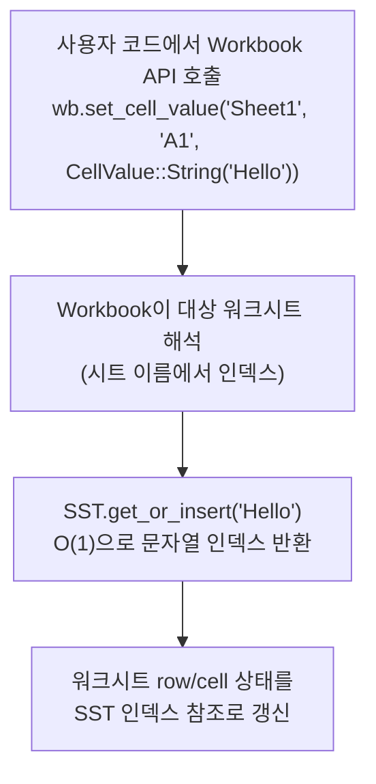
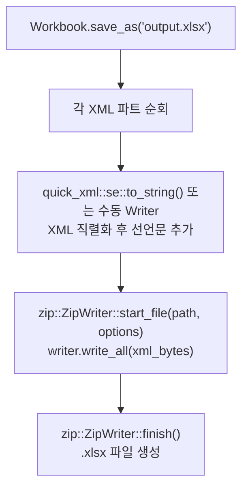
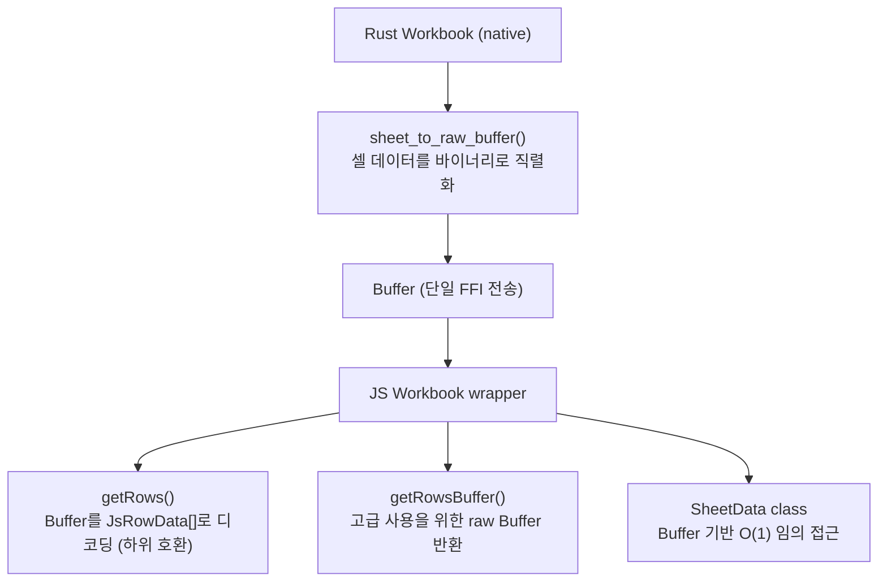

# SheetKit 아키텍처

## 1. 개요

SheetKit은 Rust와 TypeScript를 위한 고성능 SpreadsheetML 라이브러리로, Excel (.xlsx) 파일을 읽고 쓰기 위해 설계되었습니다. .xlsx 형식은 XML 파트를 포함하는 ZIP 아카이브인 OOXML (Office Open XML)입니다. SheetKit은 ZIP을 읽고, 각 XML 파트를 타입이 지정된 Rust 구조체로 역직렬화하며, 조작을 위한 고수준 API를 제공하고, 저장 시 모든 것을 유효한 .xlsx 파일로 직렬화합니다.

## 2. 크레이트 구조

### sheetkit-xml

OOXML 스키마에 매핑되는 저수준 XML 데이터 구조체입니다. 각 파일은 주요 OOXML 파트에 대응됩니다:

| 파일 | OOXML 파트 |
|---|---|
| `worksheet.rs` | Worksheet (시트 데이터, 셀 병합, 조건부 서식, 유효성 검사) |
| `shared_strings.rs` | SharedStrings (SST) |
| `styles.rs` | Stylesheet (글꼴, 채우기, 테두리, 숫자 형식, XF 레코드, DXF 레코드) |
| `workbook.rs` | Workbook (시트, 정의된 이름, 계산 속성, 피벗 캐시) |
| `content_types.rs` | `[Content_Types].xml` |
| `relationships.rs` | `.rels` 관계 파일 |
| `chart.rs` | 차트 정의 (DrawingML 차트) |
| `drawing.rs` | DrawingML (앵커, 도형, 이미지 참조) |
| `comments.rs` | 코멘트 데이터 및 작성자 |
| `doc_props.rs` | Core, App, Custom 문서 속성 |
| `pivot_table.rs` | 피벗 테이블 정의 |
| `pivot_cache.rs` | 피벗 캐시 정의 및 레코드 |
| `namespaces.rs` | OOXML 네임스페이스 상수 |

모든 타입은 XML 요소/속성 매핑을 위해 `quick-xml` 속성과 함께 `serde::Deserialize` 및 `serde::Serialize` 파생 매크로를 사용합니다.

### sheetkit-core

모든 비즈니스 로직이 이 크레이트에 위치합니다. 중심 타입은 `workbook.rs`의 `Workbook`으로, 역직렬화된 XML 상태를 소유하고 공개 API를 제공합니다.

**핵심 모듈:**

| 모듈 | 책임 |
|---|---|
| `workbook.rs` | ZIP 열기, XML 파트 역직렬화, 가변 상태 관리, 직렬화 및 저장 |
| `cell.rs` | `CellValue` 열거형 (String, Number, Bool, Empty, Date, Formula, Error), chrono를 통한 날짜 시리얼 넘버 변환 |
| `sst.rs` | O(1) 문자열 중복 제거를 위한 HashMap 기반 공유 문자열 테이블 런타임 |
| `sheet.rs` | 시트 관리: 생성, 삭제, 이름 변경, 복사, 활성 시트 설정, 틀 고정/분할, 시트 속성, 시트 보호 |
| `row.rs` | 행 작업: 삽입, 삭제, 복제, 높이 설정, 가시성, 아웃라인 수준, 행 스타일, 반복자 |
| `col.rs` | 열 작업: 너비 설정, 가시성, 삽입, 삭제, 아웃라인 수준, 열 스타일 |
| `style.rs` | 스타일 시스템: 글꼴, 채우기, 테두리, 정렬, 숫자 형식, 셀 보호. 자동 XF 중복 제거를 포함한 StyleBuilder API |
| `conditional.rs` | 조건부 서식: DXF 레코드를 사용하는 17가지 규칙 유형 (셀 값, 색상 스케일, 데이터 막대, 상위/하위, 평균 이상/이하, 중복, 빈 셀, 에러, 텍스트 매칭 등) |
| `chart.rs` | 43가지 차트 유형 생성 (bar, line, pie, area, scatter, radar, stock, surface, doughnut, combo, 3D 변형). DrawingML 앵커 및 관계 관리 |
| `image.rs` | 이미지 삽입 (11가지 형식: PNG, JPEG, GIF, BMP, ICO, TIFF, SVG, EMF, EMZ, WMF, WMZ), DrawingML의 두 셀 앵커 사용 |
| `validation.rs` | 데이터 유효성 검사 규칙 (드롭다운, 정수, 소수, 텍스트 길이, 날짜, 시간, 사용자 정의 수식) |
| `comment.rs` | VML 드로잉 형식을 사용하는 셀 코멘트 |
| `table.rs` | 테이블 및 자동 필터 지원 |
| `hyperlink.rs` | 하이퍼링크: 외부 및 이메일은 워크시트 .rels 사용, 내부 (시트 간)는 location 속성만 사용 |
| `merge.rs` | 셀 범위 병합 및 해제 |
| `doc_props.rs` | Core (dc:, dcterms:, cp:), App, Custom 문서 속성. DC 네임스페이스는 수동 quick-xml Writer/Reader 필요 |
| `protection.rs` | 레거시 비밀번호 해시를 사용한 워크북 수준 보호 |
| `page_layout.rs` | 페이지 여백, 페이지 설정, 인쇄 옵션, 머리글/바닥글 |
| `defined_names.rs` | 이름이 지정된 범위 (워크북 범위 및 시트 범위) |
| `pivot.rs` | 피벗 테이블: 캐시 정의, 캐시 레코드, 테이블 정의, 워크북 피벗 캐시 컬렉션 |
| `stream.rs` | StreamWriter: 전체 시트를 메모리에 보관하지 않고 대용량 파일을 생성하기 위한 전방 전용 XML 작성기. SST 병합, 틀 고정, 행 옵션, 열 스타일/가시성/아웃라인 지원 |
| `error.rs` | thiserror를 사용한 에러 타입 |

**수식 서브시스템** (`formula/`):

| 파일 | 책임 |
|---|---|
| `parser.rs` | AST를 생성하는 nom 기반 수식 파서. 연산자 우선순위, 셀 참조, 범위 참조, 함수 호출, 문자열/숫자/불리언 리터럴 처리 |
| `ast.rs` | AST 노드 타입 (BinaryOp, UnaryOp, FunctionCall, CellRef, RangeRef, Literal 등) |
| `eval.rs` | 수식 평가기. 워크북 데이터 접근을 위한 `CellDataProvider` trait 사용, 한 셀의 수식이 다른 셀을 참조할 때 가변/불변 대여 충돌을 피하기 위한 `CellSnapshot` (HashMap) 사용. `calculate_all()`은 의존성 그래프를 구축하고 Kahn 알고리즘으로 위상 정렬 수행 |
| `functions/mod.rs` | 함수 이름을 구현에 매핑하는 함수 디스패치 테이블 |
| `functions/math.rs` | 수학 함수 (SUM, AVERAGE, ABS, ROUND 등) |
| `functions/statistical.rs` | 통계 함수 (COUNT, COUNTA, MAX, MIN, STDEV 등) |
| `functions/text.rs` | 텍스트 함수 (CONCATENATE, LEFT, RIGHT, MID, LEN, TRIM 등) |
| `functions/logical.rs` | 논리 함수 (IF, AND, OR, NOT, IFERROR 등) |
| `functions/information.rs` | 정보 함수 (ISBLANK, ISERROR, ISNUMBER, TYPE 등) |
| `functions/date_time.rs` | 날짜/시간 함수 (DATE, TODAY, NOW, YEAR, MONTH, DAY 등) |
| `functions/lookup.rs` | 조회 함수 (VLOOKUP, HLOOKUP, INDEX, MATCH 등) |

**유틸리티** (`utils/`):

| 파일 | 책임 |
|---|---|
| `cell_ref.rs` | 셀 참조 파싱: "A1"에서 (row, col)로 변환, 열 문자 변환, 범위 파싱 |
| `constants.rs` | 공유 상수 |

### sheetkit (facade)

얇은 재내보내기 크레이트입니다. `lib.rs`에 `pub use sheetkit_core::*;`가 포함되어 있어 최종 사용자는 `sheetkit`에 의존하면 전체 공개 API를 사용할 수 있습니다.

### sheetkit-node (packages/sheetkit)

napi-rs (v3, compat-mode 없음)를 통한 Node.js 바인딩입니다.

- `src/lib.rs` -- 모든 바인딩을 포함하는 단일 파일입니다. `#[napi]` `Workbook` 클래스는 `sheetkit_core::workbook::Workbook`을 `inner` 필드로 래핑합니다. 메서드는 `inner`에 위임하고 Rust 타입과 napi 호환 타입 간 변환을 수행합니다.
- `#[napi(object)]` 구조체는 JS 친화적 데이터 전송 타입을 정의합니다 (예: `JsStyle`, `JsChartConfig`, `JsPivotTableOption`).
- napi v3의 `Either` 열거형은 다형 값을 처리합니다 (예: 문자열, 숫자 또는 불리언이 될 수 있는 셀 값).
- `binding.js` / `binding.d.ts` -- `napi build --esm`으로 생성된 저수준 네이티브 애드온 내보내기입니다.
- `index.ts` -- 네이티브 바인딩에 위임하는 공개 `Workbook` 래퍼 클래스를 제공하는 TypeScript 소스입니다. 모든 타입도 재내보내기합니다.
- `buffer-codec.ts` -- Rust에서 JS로의 효율적 행 데이터 전송을 위한 바이너리 버퍼 디코더입니다.
- `sheet-data.ts` -- 바이너리 버퍼에서 시트 셀 데이터에 지연 접근하는 `SheetData` 클래스입니다.
- 생성된 `.js`와 `.d.ts` 파일은 gitignore 처리됩니다. tsdown이 트랜스파일과 선언 파일 생성을 모두 처리합니다.

## 3. 주요 설계 결정

### XML 처리

대부분의 XML 파트는 `quick-xml`과 함께 `serde` 파생 매크로로 처리됩니다. 그러나 일부 OOXML 파트는 serde가 올바르게 처리할 수 없는 네임스페이스 접두사를 사용합니다:

- **DC 네임스페이스** (코어 속성의 `dc:`, `dcterms:`, `cp:`) -- 수동 quick-xml Writer/Reader로 직렬화 및 역직렬화합니다.
- **vt: 네임스페이스** (사용자 정의 속성의 변형 타입) -- 마찬가지로 수동 처리합니다.

XML 선언 `<?xml version="1.0" encoding="UTF-8" standalone="yes"?>`은 ZIP에 쓰기 전에 각 직렬화된 XML 파트 앞에 수동으로 추가됩니다.

### ZIP 아카이브 처리

`zip` 크레이트가 .xlsx 아카이브의 읽기와 쓰기를 담당합니다. 모든 ZIP 항목은 `SimpleFileOptions::default().compression_method(CompressionMethod::Deflated)`를 사용합니다. `open()` 시 모든 XML 파트가 메모리로 읽혀 역직렬화됩니다. `save()` 시 모든 파트가 재직렬화되어 새 ZIP 아카이브에 원자적으로 기록됩니다.

### SharedStrings (SST)

공유 문자열 테이블은 .xlsx 파일에서 선택 사항입니다. 아카이브에 `sharedStrings.xml`이 없으면 `Sst::default()`가 사용됩니다. 런타임에 SST는 O(1) 중복 제거를 위해 `HashMap<String, usize>`를 유지합니다: 문자열 셀 값이 설정되면, SST는 문자열이 이미 존재하는 경우 기존 인덱스를 반환하고, 없으면 삽입 후 새 인덱스를 반환합니다.

### 스타일 중복 제거

`add_style()`이 호출되면, 스타일 구성 요소 (글꼴, 채우기, 테두리, 정렬, 숫자 형식, 보호)가 각각 기존 레코드와 비교됩니다. 모든 구성 요소가 기존 XF (셀 형식) 레코드와 일치하면, 중복을 생성하지 않고 해당 레코드의 인덱스가 반환됩니다. 이를 통해 styles.xml을 간결하게 유지합니다.

### CellValue와 날짜 감지

`CellValue`는 String, Number, Bool, Empty, Date, Formula, Error 변형을 가진 열거형입니다.

읽기 시, 숫자 셀은 적용된 숫자 형식과 비교됩니다. 형식 ID가 알려진 날짜 형식 범위 (내장 ID 14-22, 27-36, 45-47)에 해당하거나 사용자 정의 형식 문자열이 날짜/시간 패턴을 포함하면, 셀은 `CellValue::Number` 대신 `CellValue::Date(serial_number)`로 반환됩니다. chrono 크레이트가 Excel 시리얼 넘버와 `NaiveDate`/`NaiveDateTime` 간의 변환을 처리합니다.

### 수식 시스템

수식 시스템은 두 가지 독립적인 부분으로 구성됩니다:

1. **파서**: `nom` 크레이트를 사용하여 수식 문자열을 AST로 파싱합니다. 파서는 연산자 우선순위, 중첩 함수 호출, 절대/상대 셀 참조, 범위 참조 및 모든 리터럴 타입을 포함하는 Excel 수식 구문을 처리합니다.

2. **평가기**: AST를 순회하며 결과를 계산합니다. `CellDataProvider` trait가 워크북 데이터 접근을 추상화하여 평가기가 워크북을 직접 대여하지 않습니다. 평가 전에, 한 셀의 수식이 다른 셀을 참조할 때 가변/불변 대여 충돌을 피하기 위해 셀 값이 `CellSnapshot` (`HashMap<(String, u32, u32), CellValue>`)에 스냅샷됩니다.

   `calculate_all()`은 워크북의 모든 수식 셀을 의존성 순서대로 평가합니다. 셀 의존성의 방향 그래프를 구축하고, Kahn 알고리즘으로 위상 정렬을 수행하여 리프에서 루트 순서로 셀을 평가합니다. 순환 참조는 감지되어 에러로 보고됩니다.

### 조건부 서식

조건부 서식 규칙은 전체 XF 레코드가 아닌 styles.xml의 DXF (Differential Formatting) 레코드를 참조합니다. DXF 레코드는 셀의 기본 스타일과 다른 서식 속성만 포함합니다. SheetKit은 셀 값 비교, 색상 스케일, 데이터 막대, 상위/하위 N, 평균 이상/이하, 중복, 고유 값, 빈 셀, 에러, 텍스트 매칭, 수식 기반 규칙을 포함하는 17가지 규칙 유형을 지원합니다.

### 피벗 테이블

OOXML의 피벗 테이블은 4개의 상호 연결된 파트로 구성됩니다:

1. **pivotTable 정의** (`pivotTable{n}.xml`) -- 필드 레이아웃, 행/열/데이터/페이지 필드
2. **pivotCacheDefinition** (`pivotCacheDefinition{n}.xml`) -- 소스 범위, 필드 정의
3. **pivotCacheRecords** (`pivotCacheRecords{n}.xml`) -- 캐시된 소스 데이터
4. **워크북 피벗 캐시** -- workbook.xml에서 캐시 ID를 정의에 연결하는 컬렉션

각 피벗 테이블은 전용 캐시를 갖습니다. 캐시 정의는 소스 데이터 범위를 지정하고, 캐시 레코드는 해당 데이터의 스냅샷을 저장합니다.

### StreamWriter

StreamWriter는 행 수에 관계없이 일정한 메모리 사용량으로 대용량 .xlsx 파일을 생성하는 전방 전용 API를 제공합니다. 각 `write_row()` 호출은 행을 XML로 serialize하여 디스크의 임시 파일에 추가합니다. 스트림을 워크북에 적용하면 `StreamedSheetData` 핸들(임시 파일 참조와 `<sheetViews>`, `<cols>`, `<mergeCells>`에 대한 사전 빌드된 XML 조각 포함)이 워크북에 저장됩니다. 저장 시 워크시트 XML은 헤더 작성, 임시 파일에서 행 데이터를 ZIP 엔트리로 직접 스트리밍, 푸터 추가의 순서로 구성되며, 전체 시트 XML이 메모리에 한꺼번에 존재하지 않습니다.

주요 설계 결정:

- **인라인 문자열 (`t="inlineStr"`)** 을 공유 문자열 테이블(SST) 대신 사용합니다. 이를 통해 SST 인덱스 재매핑이 불필요하며 각 행을 독립적으로 serialize할 수 있습니다.
- **임시 파일 버퍼링**: `BufWriter<NamedTempFile>`은 OS 수준의 쓰기 버퍼링과 자동 정리를 제공합니다.
- **스트리밍된 시트의 셀 값은 저장 전에 읽을 수 없습니다.** 워크북은 시트 관리를 위해 빈 placeholder `WorksheetXml`을 저장하며, 실제 데이터는 임시 파일에만 존재합니다. 셀을 읽으려면 저장 후 다시 열어야 합니다.

제약 사항:

- 행은 오름차순으로 작성해야 합니다 (임의 접근 불가).
- 열 너비, 스타일, 가시성, 아웃라인 수준, 틀 고정은 행을 쓰기 전에 설정해야 합니다.
- 틀 고정, 행 옵션 (높이, 가시성, 아웃라인), 열 수준 스타일/가시성/아웃라인을 지원합니다.

### napi 바인딩 설계

Node.js 바인딩은 `inner` 필드 패턴을 따릅니다: napi `Workbook` 클래스는 `sheetkit_core::workbook::Workbook`을 `inner` 필드로 포함합니다. 각 napi 메서드는 JS 타입에서 인수를 언래핑하고, `inner`의 해당 메서드를 호출하며, 결과를 JS 호환 타입으로 다시 변환합니다.

napi v3의 `Either` 타입은 `JsUnknown` 대신 다형 값에 사용되어 Rust와 TypeScript 양쪽에서 타입 안전성을 제공합니다.

## 4. 데이터 흐름

### .xlsx 파일 읽기

### 데이터 조작

### .xlsx 파일 쓰기

## 5. 테스트 전략

- **단위 테스트**: `#[cfg(test)]` 인라인 테스트 블록을 사용하여 모듈과 함께 배치됩니다. 각 모듈은 자체 기능을 독립적으로 테스트합니다.
- **Rust 테스트 규모**: 현재 워크스페이스 기준으로 `sheetkit-core`, `sheetkit-xml`, facade/integration crate를 합쳐 2,000개 이상의 Rust 테스트가 실행됩니다.
- **Node.js 테스트 구조**: Vitest 스위트는 `packages/sheetkit/__test__/` 아래 여러 파일로 구성됩니다 (예: `index.spec.ts`, `image-formats.spec.ts`, `sparkline.spec.ts`, `vml-comments.spec.ts`, `defined-names-sheet-protection.spec.ts`, `open-options-defaults.spec.ts`, `api-behavior.spec.ts`, `vba.spec.ts`).
- **Node.js 테스트 규모**: 현재 Node.js 테스트 스위트는 540개 테스트를 실행합니다.
- **벤치마크 기준 문서**: 성능 관련 설명은 `benchmarks/rust/RESULTS.md`, `benchmarks/rust-comparison/RESULTS.md`, `benchmarks/node/RESULTS.md`의 최신 수치와 함께 관리해야 합니다.
- **테스트 출력 파일**: 테스트 중 생성된 `.xlsx` 파일은 저장소를 깨끗하게 유지하기 위해 gitignore 처리됩니다.

## 6. Buffer 기반 FFI 전송

### 문제

Node.js 바인딩을 통해 50,000행 x 20열 시트를 읽을 때, 기존 `getRows()` 구현은 1,000,000개 이상의 개별 `JsRowCell` napi 객체를 생성했습니다. 각 객체 생성은 Rust/JS FFI 경계를 넘고 V8 힙 메모리를 할당합니다. 메모리에 남아 있는 Rust 측 워크북 데이터와 합치면, 실제 셀 데이터는 약 50MB에 불과한 시나리오에서 약 400MB의 메모리를 사용하게 됩니다.

근본 원인은 napi 객체 생성이 확장되지 않는다는 것입니다: 오버헤드는 데이터 크기가 아닌 셀 수에 비례합니다. 100만 셀 시트의 경우, napi 오버헤드만으로 200MB 이상의 V8 힙 할당이 발생하고, 셀 참조, 타입 문자열, 값 문자열에 대한 300만 건 이상의 개별 힙 할당으로 인해 Rust 측 시스템 할당자 오버헤드가 약 72MB 추가됩니다.

### 해결 방법

SheetKit은 Buffer 기반 FFI 전송 전략을 사용합니다. 셀 하나마다 JS 객체를 생성하는 대신, Rust 측에서 시트의 전체 셀 데이터를 단일 압축 바이너리 `Buffer`로 직렬화합니다. 이 Buffer는 한 번의 호출로 FFI 경계를 넘습니다. JavaScript 측에서는 코덱 레이어가 Buffer를 호출자가 필요로 하는 형태로 디코딩합니다.

결정 규칙은 단순합니다: payload가 셀 수에 비례하여 증가하면 Buffer 전송을 사용합니다. payload가 고정 크기이거나 작은 경우 (단일 셀 값, 스타일 설정, 시트 속성)에는 직접 napi 호출을 사용합니다.

### 바이너리 Buffer 형식

모든 다중 바이트 값은 리틀 엔디안입니다. Buffer는 네 개의 섹션으로 구성됩니다.

**헤더** (16바이트):

| offset | 크기 | 필드 | 설명 |
|--------|------|------|------|
| 0 | 4 | magic | `0x534B5244` ("SKRD") |
| 4 | 2 | version | 프로토콜 버전 (현재 1) |
| 6 | 4 | row_count | Buffer 내 행 수 |
| 10 | 2 | col_count | 열 수 (경계 사각형 너비) |
| 12 | 4 | flags | 비트 0: sparse 플래그. 비트 16-31: min_col offset |

**행 인덱스** (row_count * 8바이트):

각 행 항목은 8바이트입니다: `u32` 행 번호와 `u32` 셀 데이터 섹션 내 바이트 offset. 빈 행은 센티넬 offset `0xFFFFFFFF`를 사용합니다.

**문자열 테이블**:

| 필드 | 크기 | 설명 |
|------|------|------|
| count | 4 | 문자열 수 |
| blob_size | 4 | UTF-8 blob의 총 크기 (바이트) |
| offsets | count * 4 | blob 내 각 문자열의 바이트 offset |
| blob | blob_size | 연결된 UTF-8 문자열 데이터 |

문자열은 셀 payload에서 인덱스로 참조됩니다. JavaScript 측에서는 `TextDecoder`를 사용하여 Buffer에서 직접 UTF-8 슬라이스를 복사 없이 디코딩합니다.

**셀 데이터**:

각 셀은 1바이트 타입 태그와 8바이트 payload로 인코딩됩니다. 타입 태그는 다음과 같습니다:

| 태그 | 타입 | payload |
|------|------|----------|
| 0x00 | Empty | 미사용 (8바이트 0) |
| 0x01 | Number | f64 IEEE 754 |
| 0x02 | String | u32 문자열 테이블 인덱스 + 4바이트 패딩 |
| 0x03 | Bool | u8 (0 또는 1) + 7바이트 패딩 |
| 0x04 | Date | f64 Excel 시리얼 넘버 |
| 0x05 | Error | u32 문자열 테이블 인덱스 + 4바이트 패딩 |
| 0x06 | Formula | u32 문자열 테이블 인덱스 (캐시된 표시 값) + 4바이트 패딩 |
| 0x07 | RichString | u32 문자열 테이블 인덱스 (일반 텍스트) + 4바이트 패딩 |

셀당 9바이트 고정 스트라이드는 dense 모드에서 O(1) 임의 접근을 가능하게 합니다: (row, col) 위치의 셀 offset은 `cell_data_start + row_offset + col * 9`입니다.

### Dense/Sparse 자동 전환

Buffer 인코더는 경계 사각형 내의 셀 밀도에 따라 dense와 sparse 레이아웃 사이에서 자동으로 선택합니다.

**밀도 임계값**: 점유된 셀이 30%.

- **Dense 레이아웃** (밀도 >= 30%): 셀 데이터 섹션은 `row_count * col_count * 9` 바이트의 평면 그리드입니다. 빈 셀을 포함하여 경계 사각형의 모든 위치에 9바이트 슬롯이 있습니다. 이를 통해 O(1) 직접 offset 주소 지정이 가능합니다: `offset = row_index_offset + col * 9`.

- **Sparse 레이아웃** (밀도 < 30%): 각 행은 `u16` 셀 수와 가변 길이 항목을 저장합니다. 각 항목은 11바이트입니다: `u16` 열 인덱스 + `u8` 타입 + 8바이트 payload. 비어 있지 않은 셀만 저장합니다. 이를 통해 데이터가 넓은 범위에 산발적으로 분포된 시트에서 공간 낭비를 방지합니다.

sparse 플래그는 헤더의 flags 필드 비트 0에 인코딩됩니다. JavaScript 디코더는 이 플래그를 읽고 디코딩 전략을 전환합니다.

### 내부 최적화

Rust XML 레이어의 세 가지 최적화가 Buffer 직렬화 이전의 파싱 단계에서 메모리 할당을 줄입니다.

**CellTypeTag enum**: `<c>` 요소의 XML `t` 속성 (셀 타입을 나타냄: `s`는 공유 문자열, `n`은 숫자, `b`는 불리언 등)은 이전에 `Option<String>`으로 저장되었습니다. 이는 모든 셀마다 힙 `String`을 할당했습니다. 현재는 `None`, `SharedString`, `Number`, `Boolean`, `Error`, `Str`, `Date`, `InlineString` variant를 가진 1바이트 `CellTypeTag` enum입니다. 100만 셀 기준 약 24MB의 힙 할당을 제거합니다.

**CompactCellRef**: `<c>` 요소의 XML `r` 속성 (셀 참조, 예: "A1", "B2", "AA100")은 이전에 힙 할당 `String`이었습니다. 현재는 `[u8; 10]` 인라인 바이트 배열과 `u8` 길이 필드를 포함하는 `CompactCellRef` 구조체입니다. 셀 참조는 10자를 초과하지 않으므로 (최대값은 "XFD1048576"로 10바이트), 전체가 스택이나 `Cell` 구조체 내부에 인라인으로 위치하여, 100만 셀당 약 28MB의 힙 할당을 제거합니다.

**u32 열 번호**: `get_rows()` 내부 경로는 이전에 Rust 레이어 내에서 열 번호를 열 이름 문자열로 변환했습니다 (예: 1을 "A"로, 27을 "AA"로). 셀마다 `String`을 할당했습니다. 현재 열 번호는 내부적으로 `u32` 값으로 반환되며, 이름 변환은 필요한 경우에만 JavaScript 디코더에서 수행됩니다. 이를 통해 100만 셀당 약 5MB의 문자열 할당을 제거합니다.
